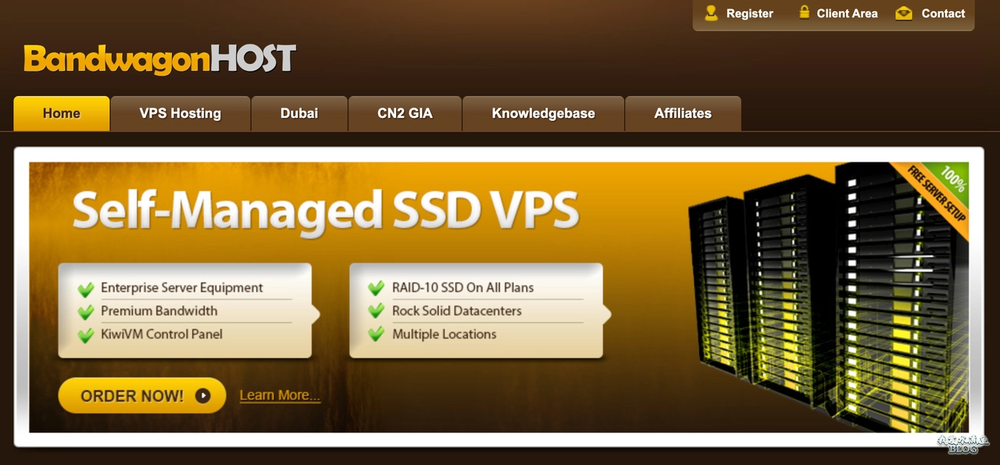
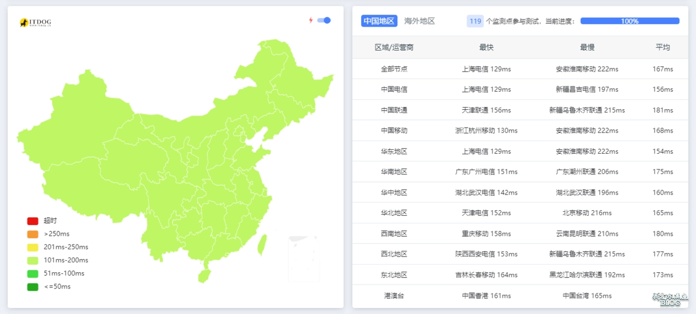
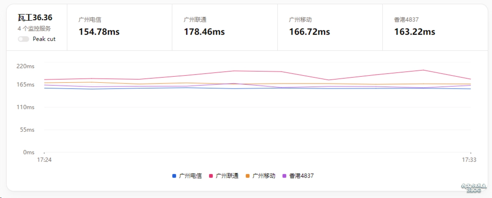
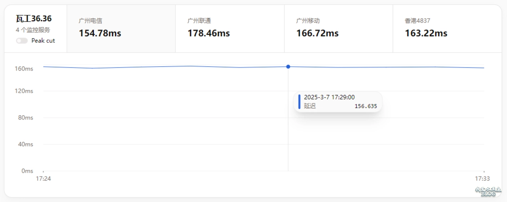
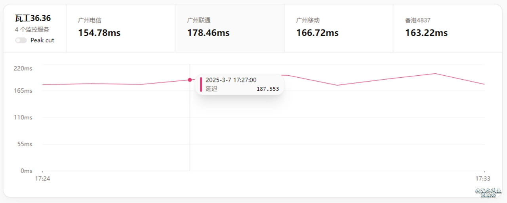
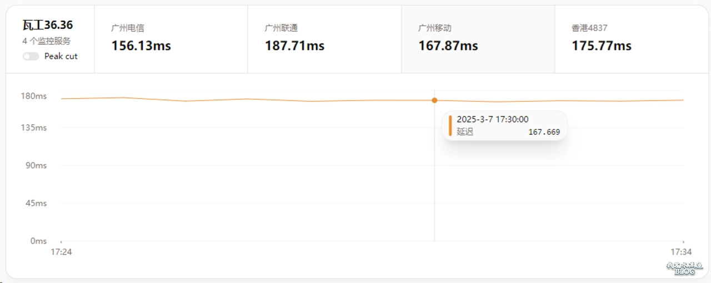
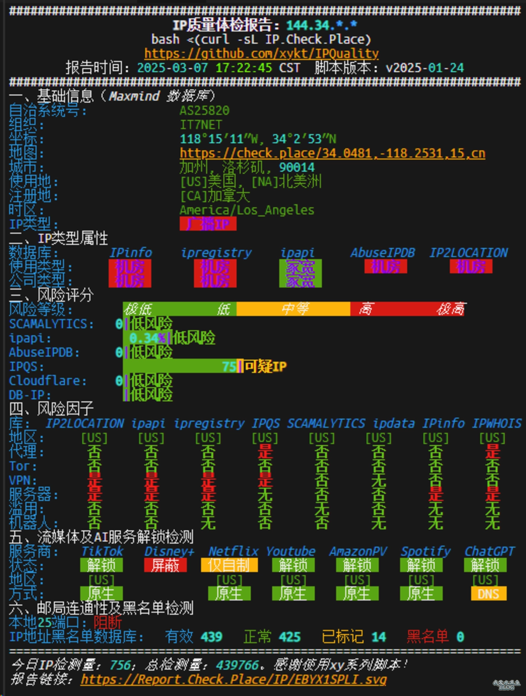

# 搬瓦工联手 NodeSeek 推美西三网优化 VPS：1C1G20G1T 年付 36.36 美元

---

想找一台延迟低、价格实在、线路稳定的美西 VPS？搬瓦工这次和 NodeSeek 合作推出的新款可能正是你要的——三网优化回程，电信 CN2 GIA + 联通移动 CMIN2，还有路线保障。关键是价格够狠：年付只要 36.36 美元，1TB 月流量，2.5Gbps 带宽。说白了，这配置这价格，在美西优化线路里真不多见。

---

## 套餐配置

这次推出的型号叫 **NODESEEK-BIGGERBOX-PRO**，配置如下：

- **CPU**：1 核 AMD EPYC-Genoa
- **内存**：1GB
- **硬盘**：20GB NVMe
- **流量**：1000GB/月（2.5Gbps 带宽）
- **线路**：电信 CN2 GIA + 联通移动 CMIN2 回程（三网优化）
- **价格**：36.36 美元/年（使用优惠码后）

限量供应，30 天内可退款——就算 IP 被墙了也能退。购买时记得用优惠码：**BWHCGLUKKB**（能再便宜 6.77%）。



## 实测表现

测试 IP：`144.34.228.10`

### 全国 TCPing

连通性表现不错，全国大部分地区延迟都在绿色区间。联通因为走上海回程，延迟会高几十毫秒，但整体还算稳定。



### 探针数据

三网优化回程，延迟控制得还行。联通走 CMIN2（移动的优化路线）经上海回程，延迟会稍高一些，但对日常使用影响不大。如果你需要一台既能稳定连接国内、又不用担心线路质量的美西 VPS，👉 [搬瓦工这款三网优化方案值得考虑](https://bandwagonhost.com/aff.php?aff=79616)。









### IP 质量报告

解锁能力在优化路线里算优秀水平了——Netflix、Disney+、ChatGPT 这些该解的基本都解了。



## 性能测试

### YABS 脚本测试

CPU 是 AMD EPYC-Genoa，单核跑分 1015，硬盘 IO 表现不错——顺序读写都能跑到 1GB/s 以上，妥妥的 NVMe 水准。网络速度测试方面，到纽约能跑满 2.85Gbps，到伦敦和新加坡也有 1Gbps 左右。

```
Basic System Information:
---------------------------------
Processor  : AMD EPYC-Genoa Processor
CPU cores  : 1 @ 2794.748 MHz
RAM        : 1.0 GiB
Disk       : 20.6 GiB

fio Disk Speed Tests:
---------------------------------
Read       | 1.15 GB/s
Write      | 1.22 GB/s

Geekbench 5:
---------------------------------
Single Core     | 1015
```

### 融合怪脚本测试

三网回程路由全是精品线路：
- **电信**：CN2 GIA
- **联通**：CMIN2（移动优化路线）
- **移动**：CMIN2

流媒体解锁方面，Netflix、Prime Video、Disney+、ChatGPT、TikTok 等主流服务都能正常访问。

## 简单评价

- **性能**：AMD EPYC-Genoa CPU，磁盘 IO 也是 NVMe 水准，性能没的说。
- **线路**：三网优化回程（电信 CN2 GIA、联通移动 CMIN2），没有晚高峰波动，美西优化线路该有的稳定性都有。
- **靠谱度**：搬瓦工在美西优化路线里的口碑一直不错，品牌够老，跑路风险基本为零。
- **性价比**：36.36 美元/年，1TB 流量，2.5Gbps 带宽——这价格明显是在对标 DMIT 的 36.9 美元套餐（500GB 流量）。联通线路稍逊于 DMIT,但流量翻倍、价格更低，性价比够高。加上 30 天退款保障,想上车的可以试试。

---

**总结一下**：如果你需要一台延迟低、线路稳、价格实惠的美西 VPS，这款三网优化方案基本能满足需求——建站、科学上网、远程办公都能胜任。限量供应,感兴趣可以早点下手。👉 [立即查看搬瓦工 NodeSeek 合作款详情](https://bandwagonhost.com/aff.php?aff=79616)
